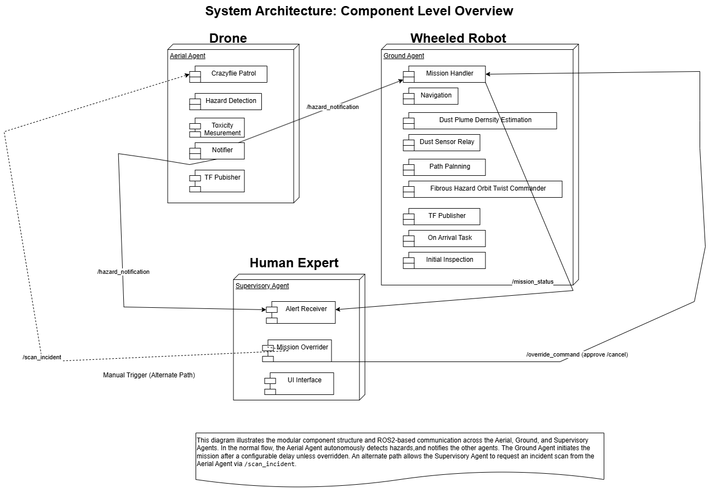

# System Architecture

## Overview

The system follows a modular, event-driven multi-agent architecture built on ROS2 Iron. Three autonomous agents — aerial, ground, and supervisory — operate independently but coordinate through a shared ROS2 communication layer using publish-subscribe topics, services, and actions.

The aerial agent is the primary sensing platform. The ground agent responds to aerial detections. The supervisory agent provides human oversight and override capability throughout.

---

## Component Diagram



---

## Agent Structure

### Aerial Agent — Crazyflie Drone

Primary sensing and detection platform. Operates autonomously throughout the mission, continuously patrolling and publishing hazard notifications.

| Component | Responsibility |
|-----------|---------------|
| `CrazyfliePatrol` | Autonomous patrol execution with scan incident interpolation |
| `HazardDetection` | Real-time AI-based classification and detection of fibrous and dust hazards |
| `ToxicityMeasurement` | Gas concentration monitoring with four-state threshold classification |
| `Notifier` | Publishes hazard pose, type, and parameters on detection confirmation |
| `TFPublisher` | Broadcasts drone position for RViz visualisation |

### Ground Agent — Agilex Wheeled Robot

Responds to aerial hazard notifications. Executes hazard-specific on-arrival tasks coordinated by a central mission handler.

| Component | Responsibility |
|-----------|---------------|
| `MissionHandlerNode` | Central orchestrator — parses notifications, manages override window, coordinates mission execution |
| `PathPlannerNode` | Computes optimal navigation paths to hazard locations |
| `NavigationNode` | Executes autonomous movement via Nav2 |
| `FibrousHazardOrbitTwistCommander` | Commands 360-degree orbital surveys for asbestos analysis |
| `DustPlumeDensityEstimation` | Estimates dust density at hazard site |
| `DustSensorRelay` | Publishes real-time dust sensor readings |
| `OnArrivalTask` | Coordinates hazard-specific actions on arrival |
| `InitialInspection` | Performs initial survey and image capture for fibrous hazards |
| `TFPublisher` | Broadcasts ground robot position for RViz visualisation |

### Supervisory Agent — Human Expert Dashboard

Provides human oversight, alert monitoring, and mission override capability via a Tkinter dashboard.

| Component | Responsibility |
|-----------|---------------|
| `AlertReceiver` | Receives hazard notifications and alert messages and forwards them to the UI interface |
| `MissionOverrider` | Manages override window — approve or cancel ground missions |
| `UIInterface` | Real-time Tkinter dashboard for alerts, toxicity readings, dust density, and mission status |

---

## Architectural Layers

```
┌─────────────────────────────────────────────────────┐
│                  Supervisory Layer                   │
│         Human oversight · Override · Alerts          │
└─────────────────────┬───────────────────────────────┘
                      │ /hazard_notification
                      │ /override_command
┌─────────────────────▼───────────────────────────────┐
│                   Aerial Layer                       │
│      Patrol · Detection · Toxicity · Notification    │
└─────────────────────┬───────────────────────────────┘
                      │ /hazard_notification
┌─────────────────────▼───────────────────────────────┐
│                   Ground Layer                       │
│   Mission · Navigation · Inspection · Sensing        │
└─────────────────────────────────────────────────────┘
```

---

## Communication Architecture

The system uses a hybrid ROS2 communication model:

- **Topics** — asynchronous, event-driven inter-agent coordination
- **Services** — request/response interactions within and between agents
- **Actions** — long-running tasks such as navigation and orbital manoeuvres

### Key Topics

| Topic | Publisher | Subscriber(s) | Purpose |
|-------|-----------|--------------|---------|
| `/hazard_notification` | Aerial (Notifier) | Ground, Supervisory | Hazard location, type, parameters |
| `/override_command` | Supervisory | Ground (Mission Handler) | Mission approve / cancel |
| `/mission_status` | Ground | Supervisory | Mission progress and completion |
| `/toxicity_result` | Aerial | Supervisory | Gas readings and hazard location |
| `/density_sensor_result` | Ground | Supervisory | Real-time dust sensor readings |
| `/density_estimation_result` | Ground | Supervisory | Estimated dust plume density |
| `/navigation_result` | Ground (Navigation) | Mission Handler, UI | Navigation completion status |
| `/base_return` | Ground | Supervisory | Return-to-base notification |
| `/scan_incident` | Supervisory | Aerial (Patrol) | Manual drone scan request |

### Key Services & Actions

| Service / Action | Client | Server | Purpose |
|-----------------|--------|--------|---------|
| `navigate_to_pose` | Mission Handler | Navigation | Goal pose after path planning |
| `cancel_mission` | Supervisory | Mission Handler | Cancel within override window |
| `approve_mission` | Supervisory | Mission Handler | Immediate approval |
| `classify_hazard` | Crazyflie Patrol | Hazard Detection | Classification of candidate hazard |
| `detect_hazard` | Crazyflie Patrol | Hazard Detection | Object detection for identification |
| `request_path_plan` | Mission Handler | Path Planner | Optimal path computation |
| `orbit_hazard` | Fibrous Orbit Commander | Navigation | 360-degree orbit manoeuvre |

---

## Coordination Model

The system follows an **aerial-led, ground-responsive** coordination model with human oversight:

1. Aerial agent detects hazard autonomously during patrol
2. Hazard notification published to ground and supervisory agents simultaneously
3. Ground agent enters pending state — override window opens
4. Supervisory agent approves or cancels within the window
5. If no command received — mission proceeds automatically on timeout
6. Ground agent navigates, performs hazard-specific task, returns to base
7. Mission status published to supervisory agent throughout

**Alternative path — manual scan:**
Supervisory agent publishes `/scan_incident` → aerial agent verifies area of interest → publishes standard hazard notification if confirmed → standard coordination flow proceeds.

See [Coordination Flowchart](../diagrams/CoOrdinationFlowchart.png) for the full decision flow.

---

## Key Design Characteristics

**Agent independence**
Each agent operates autonomously within its own responsibility boundary. Agents communicate through well-defined ROS2 interfaces — no direct coupling between agent internals.

**Human-in-the-loop with graceful timeout**
The override window ensures human oversight without blocking autonomous operation. If the supervisory agent does not intervene, the mission proceeds — safety and efficiency are balanced.

**Hazard-specific on-arrival behaviour**
The `OnArrivalTask` component determines the correct action based on hazard type. This keeps mission logic centralised while supporting multiple hazard workflows without branching across agents.

**Simulation-first architecture**
All agents run in Gazebo Fortress simulation with RViz visualisation. The architecture is designed with real hardware deployment in mind — ROS2 over wireless for inter-agent communication, offboard computation for each platform.
