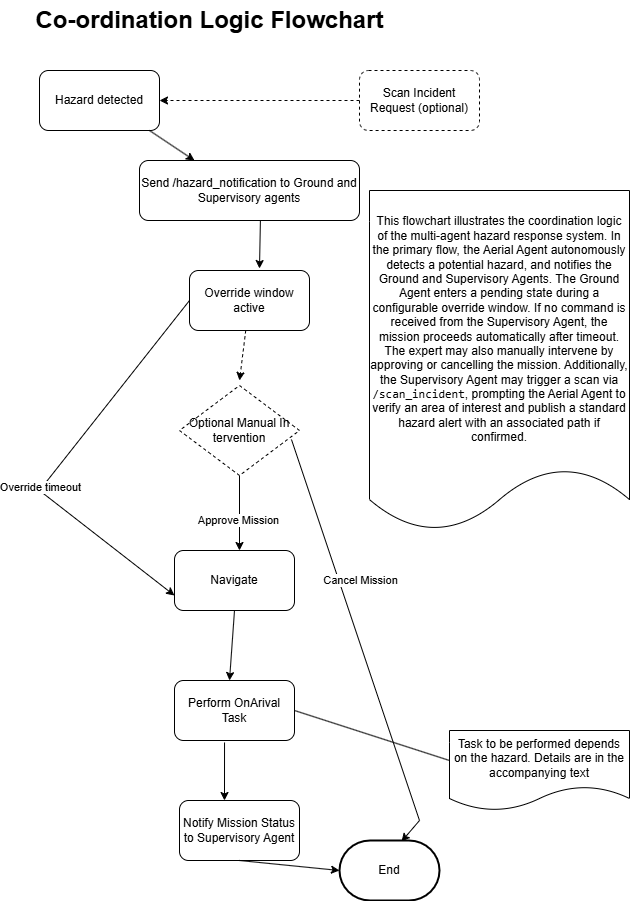
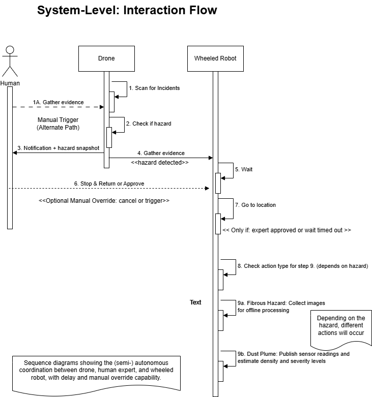
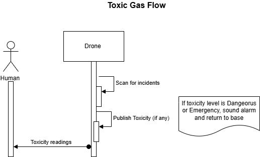

# Mission Workflows

## Overview

The system supports three primary mission workflows, each triggered by a specific hazard type detected by the aerial agent. All workflows follow the same high-level coordination pattern — aerial detection, hazard notification, override window, ground agent response — but differ in on-arrival behaviour.

An alternative entry point allows the supervisory agent to manually trigger a scan via `/scan_incident`.

---

## Coordination Flow

### Primary Flow
1. Aerial agent detects hazard during patrol
2. Publishes `/hazard_notification` to ground and supervisory agents
3. Ground agent enters pending state — override window opens
4. Supervisory agent approves or cancels within the window
5. If no command received — mission proceeds automatically on timeout
6. Ground agent navigates to hazard location
7. Performs hazard-specific on-arrival task
8. Returns to base — mission status published to supervisory agent

### Manual Scan Flow (Alternative Entry)
1. Supervisory agent publishes `/scan_incident`
2. Aerial agent verifies area of interest
3. If confirmed — publishes standard `/hazard_notification`
4. Standard coordination flow proceeds from step 3 above

---

## System Interaction Flow

---

## Workflow 1 — Fibrous Hazard (Asbestos)

**Triggered by:** Aerial agent YOLOv8l detection of fibrous material

### Phase 1 — Initial Response
1. Aerial agent detects fibrous hazard, publishes notification (location, type, diameter)
2. Override window opens — supervisory agent approves or cancels
3. Ground agent navigates to hazard location via Nav2
4. On arrival — `InitialInspection` executes:
   - Robot spins in place
   - Captures images for offline processing
5. Ground agent returns to base
6. Mission status published to supervisory agent

### Phase 2 — Full Orbital Survey
1. Second override window opens at base
2. Supervisory agent approves or cancels orbital survey
3. Ground agent navigates back to hazard location
4. `FibrousHazardOrbitTwistCommander` executes full 360-degree orbital survey:
   - Maintains safety radius around hazard
   - Captures images from all angles for offline asbestos analysis
5. Ground agent returns to base
6. Mission complete — status published

**On-arrival task:** Image capture (Phase 1) + 360-degree orbital survey (Phase 2)
**Offline processing:** ResNet classification + MLP asbestos index regression on captured images
**Typical runtime:** ~16 minutes

---

## Workflow 2 — Dust Plume

**Triggered by:** Aerial agent YOLOv8x detection of dust plume

1. Aerial agent detects dust plume, publishes notification (location, estimated area)
2. Override window opens — supervisory agent approves or cancels
3. Ground agent navigates to hazard site via Nav2
4. On arrival — two parallel sensing components execute:

   **Dust Sensor Plugin (simulated measurements)**
   - Simulated electrochemical sensor measurements activate as robot approaches plume
   - Readings increase in proximity to plume centre
   - Raw measurements published to supervisory dashboard via `DustSensorRelay`

   **AI Density Estimation**
   - `DustPlumeDensityEstimation` processes camera feed in real time
   - AI model estimates plume density from visual input
   - Density output has direct operational impact — alarm triggered if threshold exceeded
   - Density readings published to supervisory dashboard

5. Ground agent returns to base regardless of measurement outcome
6. Mission complete — status published

**On-arrival task:** Simulated dust sensor measurements + AI-based real-time plume density estimation
**Typical runtime:** ~9 minutes

---

## Workflow 3 — Toxic Gas

**Triggered by:** Aerial agent toxicity measurement threshold breach

The toxic gas workflow is **aerial-only** — the ground agent does not participate.

1. Aerial agent monitors gas concentrations continuously during patrol
2. `ToxicityMeasurement` classifies readings into four states:
   - **Safe** — no action
   - **Elevated** — readings published to supervisory dashboard
   - **Dangerous** — alarm triggered, readings published
   - **Emergency** — immediate return to base
3. Three consecutive Dangerous readings → immediate return to base
4. Single Emergency reading → immediate return to base
5. All toxicity readings published to supervisory dashboard in real time

**Conservative safety logic:** the system errs toward early return to base to protect the aerial platform and prevent exposure escalation.
**Typical runtime:** ~5 minutes

---

## Override Window Behaviour

| Scenario | Outcome |
|----------|---------|
| Supervisory approves within window | Mission proceeds immediately |
| Supervisory cancels within window | Mission cancelled, ground agent remains at base |
| No command received — window timeout | Mission proceeds automatically |

The override window duration is configurable. Default: 5 minutes.

---

## Mission Runtime Summary

| Mission | Typical Runtime |
|---------|----------------|
| Fibrous hazard (both phases) | ~16 minutes |
| Dust plume | ~9 minutes |
| Toxic gas (aerial only) | ~5 minutes |
